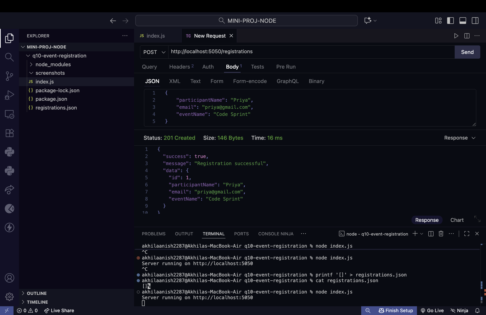
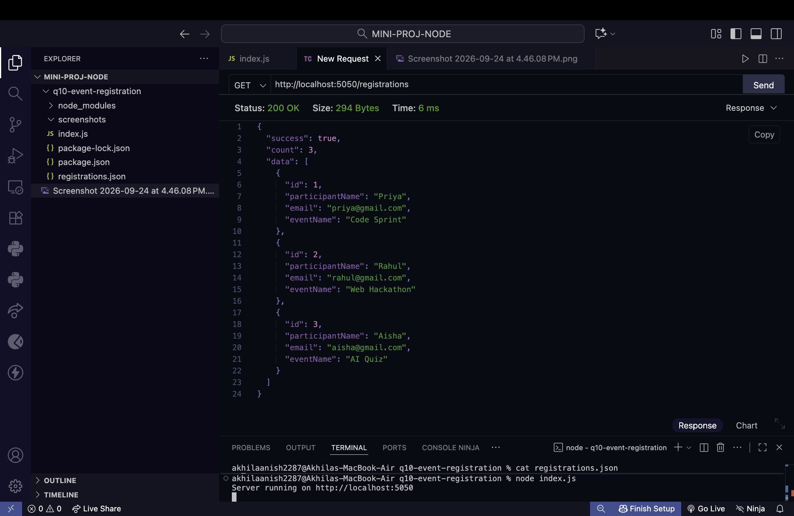
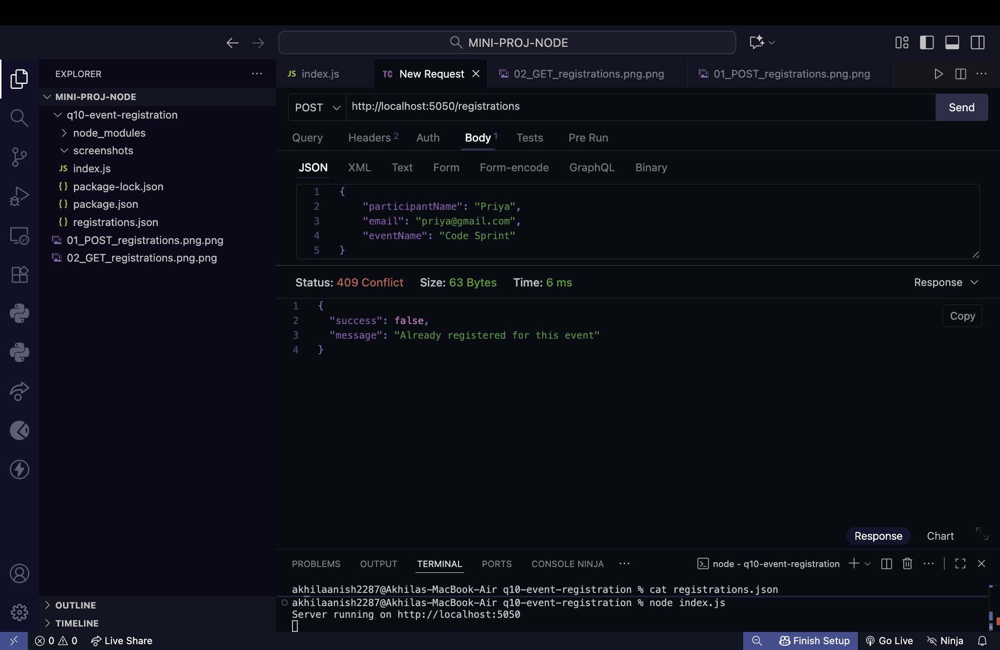
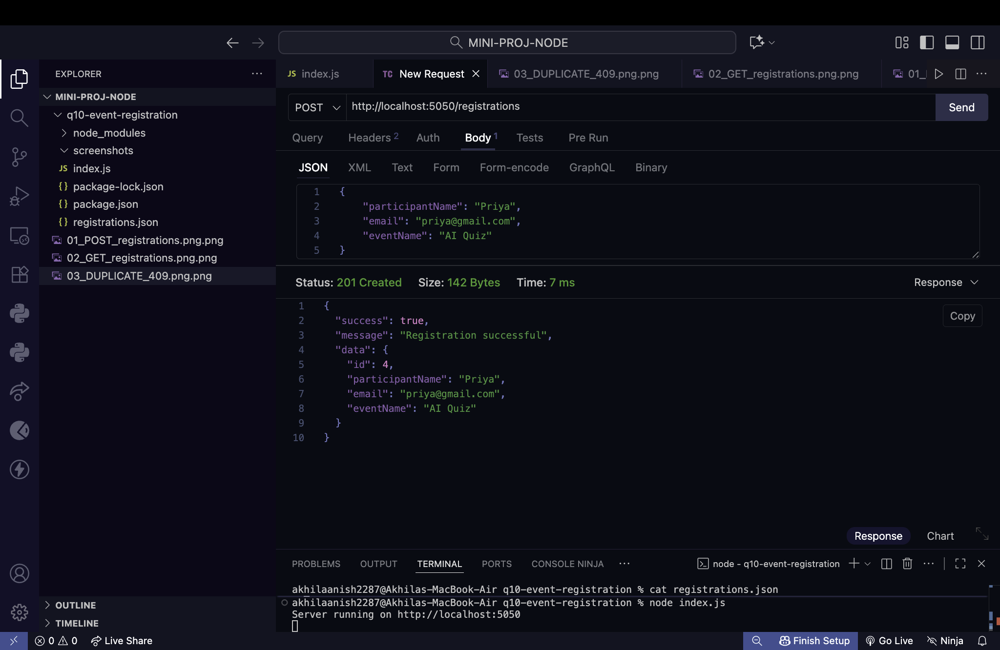
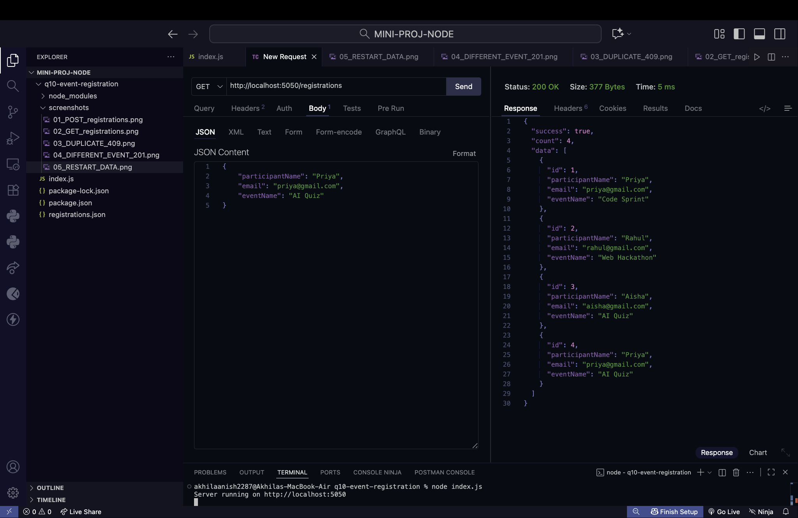

# Question 10: Event Registration Saved in `registrations.json`

## Student Details

**Name:** Akhila Anish Das
**Roll No.:** 150096725016
**Cohort:** Larry Page
**Course:** B.Tech CSE 2025–2029

---

# Problem Statement

The college is organising a Tech Fest. Students must register for events through an API. Registrations must be saved permanently in a JSON file, and the same student must not be able to register twice for the same event.

---

# Objective

Practise reading and writing a JSON file using `fs`, validating received data, preventing duplicate registrations, and storing data permanently without using a database.

---

# Requirements

* Create `registrations.json` containing an empty array `[]` initially.
* Run the server on port `5050`.
* Create `POST /registrations`.
* Receive `participantName`, `email`, and `eventName`.
* Use `express.json()`.
* Read existing registrations using `fs.readFile()`.
* Convert JSON data using `JSON.parse()`.
* Add each registration with a unique numeric `id`.
* Save registrations using `JSON.stringify()` and `fs.writeFile()`.
* Return `400` if a required field is missing.
* Return `409` if the same email is already registered for the same event.
* Return `201` when a registration is successfully created.
* Create `GET /registrations`.
* Return all registrations together with their total count.
* Store all registrations permanently in `registrations.json`.
* Do not use a database.

---

# Technologies Used

* Node.js
* Express.js
* JavaScript
* File System (`fs`)
* JSON
* Postman
* Visual Studio Code

---

# Project Structure

The project is located inside the `MINI-PROJ-NODE` folder.

```text
MINI-PROJ-NODE/
│
└── q10-event-registration/
    │
    ├── node_modules/
    ├── screenshots/
    │   ├── 01_POST_registrations.png
    │   ├── 02_GET_registrations.png
    │   ├── 03_DUPLICATE_409.png
    │   ├── 04_DIFFERENT_EVENT_201.png
    │   ├── 05_RESTART_DATA.png 
    │   └── README.md
    │
    ├── index.js
    ├── package.json
    ├── package-lock.json
    └── registrations.json
```

`node_modules` is used locally and should not be pushed to GitHub.

---

# Server

The Express server runs on port `5050`.

```text
http://localhost:5050
```

---

# POST /registrations

This endpoint receives a participant's name, email, and event name.

### Endpoint

```text
POST http://localhost:5050/registrations
```

### Request Body

```json
{
    "participantName": "Priya",
    "email": "priya@gmail.com",
    "eventName": "Code Sprint"
}
```

### Successful Response

**Status: `201 Created`**

```json
{
    "success": true,
    "message": "Registration successful",
    "data": {
        "id": 1,
        "participantName": "Priya",
        "email": "priya@gmail.com",
        "eventName": "Code Sprint"
    }
}
```



---

# GET /registrations

This endpoint returns all registrations stored in `registrations.json` together with the total number of registrations.

### Endpoint

```text
GET http://localhost:5050/registrations
```

### Successful Response

**Status: `200 OK`**

```json
{
    "success": true,
    "count": 4,
    "data": [
        {
            "id": 1,
            "participantName": "Priya",
            "email": "priya@gmail.com",
            "eventName": "Code Sprint"
        },
        {
            "id": 2,
            "participantName": "Rahul",
            "email": "rahul@gmail.com",
            "eventName": "Web Hackathon"
        },
        {
            "id": 3,
            "participantName": "Aisha",
            "email": "aisha@gmail.com",
            "eventName": "AI Quiz"
        },
        {
            "id": 4,
            "participantName": "Priya",
            "email": "priya@gmail.com",
            "eventName": "AI Quiz"
        }
    ]
}
```



---

# Duplicate Registration Check

The API prevents the same email from registering for the same event more than once.

### Request

```json
{
    "participantName": "Priya",
    "email": "priya@gmail.com",
    "eventName": "Code Sprint"
}
```

### Response

**Status: `409 Conflict`**

```json
{
    "success": false,
    "message": "Already registered for this event"
}
```



---

# Same Email With a Different Event

The same email is allowed to register for another event.

### Request

```json
{
    "participantName": "Priya",
    "email": "priya@gmail.com",
    "eventName": "AI Quiz"
}
```

### Response

**Status: `201 Created`**

```json
{
    "success": true,
    "message": "Registration successful",
    "data": {
        "id": 4,
        "participantName": "Priya",
        "email": "priya@gmail.com",
        "eventName": "AI Quiz"
    }
}
```



---

# Data Persistence After Server Restart

The server was stopped and started again using:

```bash
node index.js
```

The server started successfully on:

```text
http://localhost:5050
```

After restarting the server, `GET /registrations` was called again.

The previously saved registrations were still available, confirming that the data was stored permanently in `registrations.json`.



---

# Testing Performed

The following tests were completed:

### Test 1 — Successful Registration

A participant was registered successfully using:

```text
POST /registrations
```

The API returned:

```text
201 Created
```

### Test 2 — Three Participant Registrations

Three different registrations were created:

```text
Priya  → Code Sprint
Rahul  → Web Hackathon
Aisha  → AI Quiz
```

The `GET /registrations` endpoint returned the saved registrations.

### Test 3 — Duplicate Registration

The same email was registered again for the same event.

The API returned:

```text
409 Conflict
```

with:

```text
Already registered for this event
```

### Test 4 — Same Email, Different Event

The same email was registered for another event.

The API returned:

```text
201 Created
```

and created a new registration with a unique numeric ID.

### Test 5 — Server Restart

The server was restarted and `GET /registrations` was called again.

The previously saved registrations remained available, confirming file-based persistence.

---

# File Handling

The project uses Node.js `fs` methods to permanently store registrations.

### Reading Existing Registrations

```javascript
fs.readFile()
```

The existing contents of `registrations.json` are read before adding a new registration.

### Converting JSON Into JavaScript

```javascript
JSON.parse()
```

The JSON file contents are converted into a JavaScript array so that registrations can be checked and added.

### Converting JavaScript Into JSON

```javascript
JSON.stringify()
```

The updated registration array is converted back into JSON format.

### Saving the Updated Data

```javascript
fs.writeFile()
```

The updated array is written back to `registrations.json`.

---

# registrations.json

The file initially contains:

```json
[]
```

After registrations are created, the file contains the saved registration objects.

The existing registrations are retained when new registrations are added.

---

# Validation and Duplicate Prevention

The API checks that all three required fields are provided:

```text
participantName
email
eventName
```

If a required field is missing, the API returns:

```text
400 Bad Request
```

The API also checks whether the combination of:

```text
email + eventName
```

already exists.

If it exists, the API returns:

```text
409 Conflict
```

If the email exists but the event is different, the new registration is allowed.

---

# API Endpoints

### POST

```text
POST http://localhost:5050/registrations
```

Creates and saves a new registration.

### GET

```text
GET http://localhost:5050/registrations
```

Returns all saved registrations and their count.

---

# HTTP Status Codes

* `200 OK` — Registrations retrieved successfully.
* `201 Created` — New registration created successfully.
* `400 Bad Request` — Required field is missing.
* `409 Conflict` — Same email is already registered for the same event.

---

# How to Run the Project

Open the terminal inside the project folder:

```bash
cd q10-event-registration
```

Install the required dependencies:

```bash
npm install
```

Start the server:

```bash
node index.js
```

The server will run at:

```text
http://localhost:5050
```

---

# Testing Using Postman

Use Postman to test the following endpoints.

### Create Registration

```text
POST http://localhost:5050/registrations
```

Select:

```text
Body → raw → JSON
```

Use:

```json
{
    "participantName": "Priya",
    "email": "priya@gmail.com",
    "eventName": "Code Sprint"
}
```

### Get Registrations

```text
GET http://localhost:5050/registrations
```

### Test Duplicate

Send the same registration again:

```json
{
    "participantName": "Priya",
    "email": "priya@gmail.com",
    "eventName": "Code Sprint"
}
```

Expected result:

```text
409 Conflict
```

### Test Different Event

Use the same email with another event:

```json
{
    "participantName": "Priya",
    "email": "priya@gmail.com",
    "eventName": "AI Quiz"
}
```

Expected result:

```text
201 Created
```

---

# Important Rules Followed

* Existing registrations are not deleted.
* Existing registrations are not overwritten.
* Each registration receives a unique numeric ID.
* The same email can register for different events.
* The same email cannot register twice for the same event.
* `registrations.json` stores the registrations permanently.
* `registrations.json` remains a valid JSON array.
* No database is used.
* `express.json()` is used.
* `fs.readFile()` is used to read registrations.
* `JSON.parse()` is used to process the JSON data.
* `JSON.stringify()` is used to convert the updated data to JSON.
* `fs.writeFile()` is used to save the updated registrations.
* The server runs on port `5050`.

---

# Conclusion

The Event Registration API was successfully implemented using Node.js and Express.js.

The project stores registrations permanently in `registrations.json`, validates the required fields, generates unique numeric IDs, prevents duplicate registration for the same email and event, allows the same email to register for different events, returns all registrations with a count, and preserves the saved data even after restarting the server.
